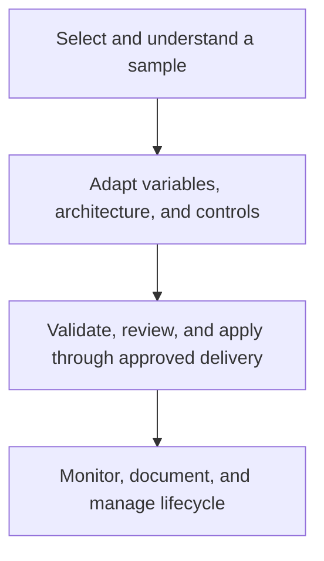

# Azure Terraform Templates

This learning hub organizes the repository's sample Terraform configurations for deploying and managing Azure resources. Use the templates as a starting point for understanding resource patterns, then adapt them to your subscription, architecture, policy, naming, security, networking, and operational requirements.

!!! warning
    These are examples, not production-ready blueprints. A successful `terraform plan` does not prove a deployment is secure, compliant, affordable, recoverable, or appropriate for your workload. Review every variable and resource before applying it to a shared or production subscription.

  <a class="guide-card" href="use-templates-safely/"><strong>Use templates safely</strong>Prepare credentials, state, variables, validation, and review before creating Azure resources.</a>
  <a class="guide-card" href="template-catalog/"><strong>Template catalog</strong>Browse core, data, compute, networking, identity, analytics, AI, IoT, and backup categories.</a>
  <a class="guide-card" href="secure-and-govern-deployments/"><strong>Secure and govern</strong>Plan least privilege, secrets, network boundaries, policy, naming, tagging, and approvals.</a>
  <a class="guide-card" href="operate-terraform-changes/"><strong>Operate changes</strong>Use deliberate state, release, drift, cost, recovery, and destroy practices.</a>

## What is in a template

| File | Purpose |
| --- | --- |
| `main.tf` | Declares the Azure resources and dependencies. |
| `variables.tf` | Defines configurable inputs, types, and defaults. |
| `provider.tf` | Pins Terraform/provider requirements and configures the AzureRM provider. |
| `terraform.tfvars` | Supplies example values that must be reviewed for each environment. |
| `outputs.tf` | Exposes selected resource identifiers and endpoints after a deployment. |

## Source material

- [Repository overview](https://github.com/Cloud2BR-MSFTLearningHub/AzureTerraformTemplates-v0.0.0/blob/main/README.md)
- [Core infrastructure templates](https://github.com/Cloud2BR-MSFTLearningHub/AzureTerraformTemplates-v0.0.0/tree/main/0_core-infrastructure)
- [Storage and database templates](https://github.com/Cloud2BR-MSFTLearningHub/AzureTerraformTemplates-v0.0.0/tree/main/1_storage-databases)
- [Compute and container templates](https://github.com/Cloud2BR-MSFTLearningHub/AzureTerraformTemplates-v0.0.0/tree/main/2_compute-containers)
- [Identity and security templates](https://github.com/Cloud2BR-MSFTLearningHub/AzureTerraformTemplates-v0.0.0/tree/main/4_identity-security)