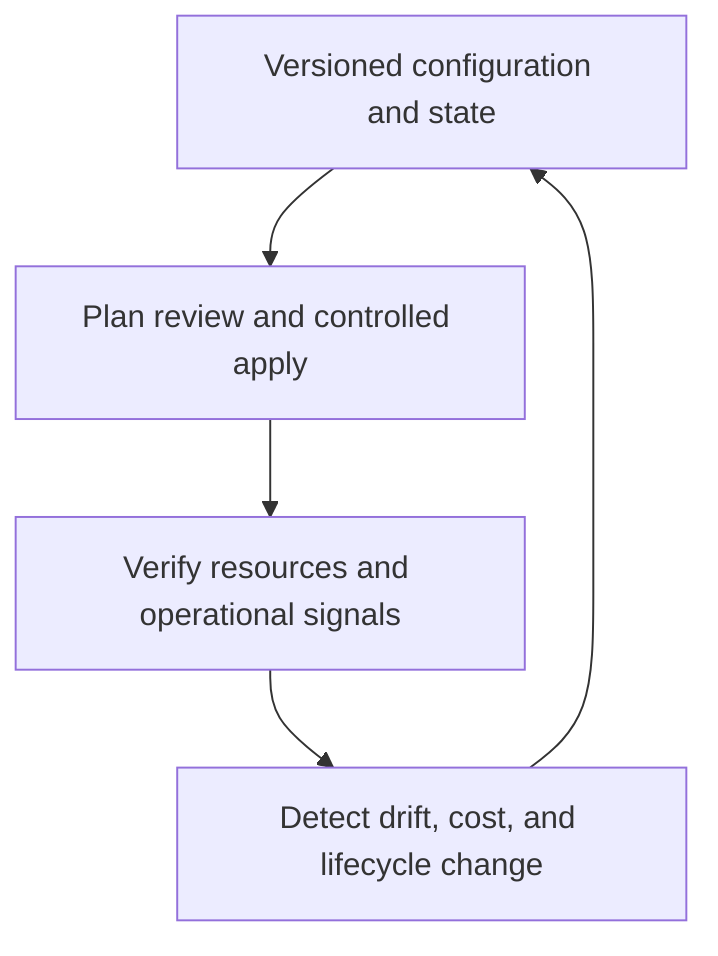

# Operate Terraform changes

Infrastructure as code is an operating practice, not a one-time provisioning step. Keep the source, state, provider versions, release path, monitoring, and recovery process under active ownership.

## Operational discipline

| Practice | Why it matters |
| --- | --- |
| Remote state and locking | Prevents accidental concurrent updates and provides an approved recovery boundary. |
| Version constraints | Reduces unexpected behavior from Terraform or provider upgrades. |
| Pull-request review | Makes resource changes, policy impact, and cost implications auditable before apply. |
| Environment separation | Limits blast radius and prevents state, names, credentials, or endpoints from being confused across stages. |
| Drift management | Detects changes made outside Terraform and drives a conscious reconcile-or-adopt decision. |
| Monitoring and budgets | Confirms resources work as intended and surfaces cost or reliability effects after release. |

## Release and recovery checklist

- Keep immutable records of the reviewed plan and the applied source revision.
- Define post-deployment checks for service health, access, networking, diagnostics, and expected cost signals.
- Understand replacement behavior before changing immutable resource properties.
- Use backups, retention, resource locks, and service-specific recovery paths where the workload requires them.
- Keep destroy operations separate from routine changes, with explicit approvals and verification of the target state.

## Provider and template versions

The resource-group template pins Terraform to `>= 1.8, < 2.0` and AzureRM to `~> 4.16.0`. Treat those constraints as an input to your compatibility review, not a universal version mandate. Upgrade in a test environment, inspect the plan, and validate application behavior before changing a shared environment.

!!! tip
    The best time to decide on state recovery, ownership, cost accountability, and a destroy approval process is before the first shared deployment. Retrofitting those boundaries after resources are in use is costly and risky.