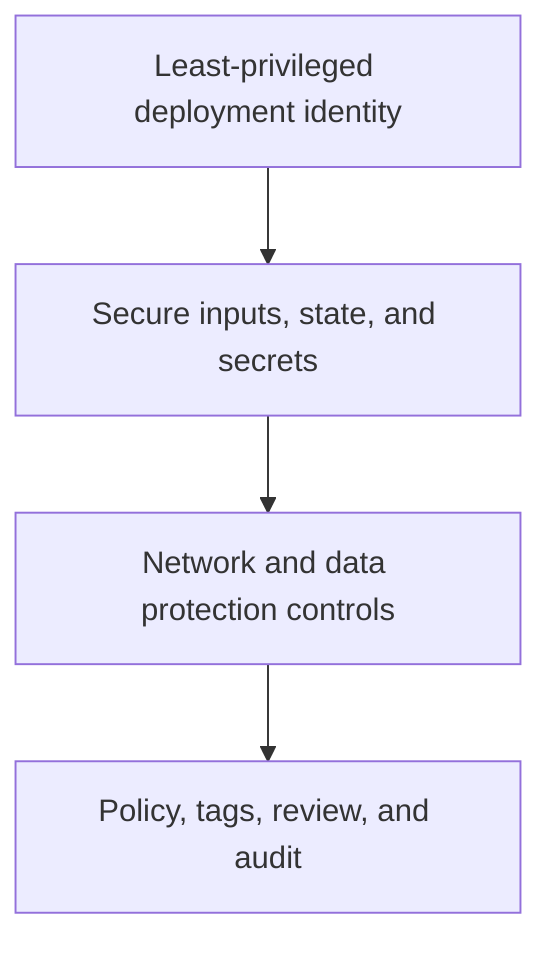

# Secure and govern deployments

Terraform makes configuration repeatable, including insecure configuration. Establish security and governance guardrails before templates are copied across subscriptions or environments.

## Security baseline

| Concern | Practical control |
| --- | --- |
| Credentials | Use approved identity flows and managed identities where applicable; keep secrets out of code, plans, logs, and state exposure. |
| Authorization | Separate authoring, review, and apply permissions; scope Azure RBAC and Terraform state access narrowly. |
| Network exposure | Review public endpoints, firewall defaults, private connectivity, permitted IPs, subnet design, and DNS dependencies. |
| Data protection | Select supported encryption, backup, retention, purge-protection, and recovery settings deliberately. |
| Governance | Standardize required tags, naming, locations, resource locks, policy assignments, diagnostic settings, and ownership metadata. |

## Key Vault example: a decision, not a default

The [Key Vault template](https://github.com/Cloud2BR-MSFTLearningHub/AzureTerraformTemplates-v0.0.0/tree/main/4_identity-security/key-vault) exposes deliberate choices for RBAC authorization, public network access, network ACLs, soft-delete retention, and purge protection. Those settings affect who can reach secrets and whether a destroy operation can fully remove a vault. Review them with security and platform owners before an environment deployment.

## Plan review questions

1. Does the plan create public endpoints, broad firewall rules, or unrestricted egress?
2. Is every identity, role, policy exemption, and secret path justified and approved?
3. Are globally unique names, DNS records, IP ranges, and regions suitable for the intended environment?
4. Does the proposed change meet the organization’s policy, data residency, tagging, logging, and budget requirements?
5. Can the team recover from an unintended change, including state or resource deletion?

!!! warning
    Template example values can be intentionally simple for learning. Do not assume defaults such as public access, permissive network ACLs, or a given SKU meet production standards.