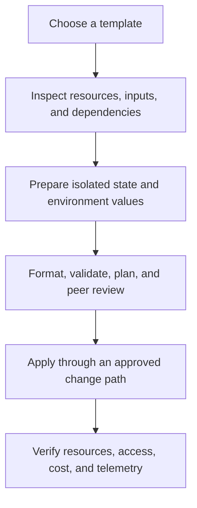

# Use templates safely

Templates accelerate learning and repeatable configuration, but they must be treated as code that changes cloud resources. Establish the subscription, identity, state, variables, review criteria, and rollback plan before any apply operation.



## Before you run Terraform

| Area | Check |
| --- | --- |
| Toolchain | Use the required Terraform and provider versions; review provider upgrades deliberately. |
| Subscription | Confirm the active Azure subscription and its permitted regions, policies, quotas, and ownership. |
| Identity | Use a least-privileged human or workload identity; do not place credentials in source-controlled variable files. |
| State | Use an approved remote backend, protect state access, and understand state-locking and recovery behavior. |
| Inputs | Replace placeholder names, locations, CIDRs, SKUs, tags, and any sample values with environment-approved values. |
| Dependencies | Review what the template creates implicitly, including resource groups, networks, subnets, identities, or public endpoints. |

## Recommended learning loop

```sh
az login
az account show
terraform init
terraform fmt -check
terraform validate
terraform plan -out=tfplan
```

Review the plan with the resource owner before applying it. Do not commit secrets or generated state. The repository intentionally ignores state and most sensitive variable-file patterns; maintain equivalent protection in derived projects and delivery pipelines.

!!! danger
    `terraform destroy` removes resources managed by the selected state. Review the exact plan, backup and retention settings, dependent workloads, and recovery obligations before using it. Some services, such as protected Key Vaults, have deletion behavior that can prevent immediate cleanup.

## Start with a narrow scope

Run a minimal, isolated deployment first. Confirm the resource properties, network reachability, access model, tags, diagnostic settings, and cost behavior before composing the pattern into a larger environment.